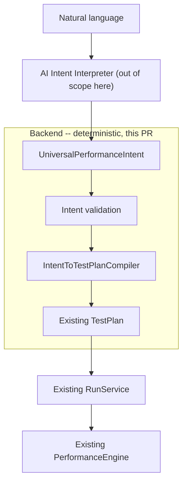

# AI Intent Architecture

**Status: draft, pending gate review.** Authored as both the architecture
proposal (Dev-3 role) and its implementation (Dev-1 role) in the same PR,
since no separate architect was available to review before implementation
began. Treat this document as the contract under review, not yet frozen --
`docs/performance_engine_interface.md` remains the only interface with that
status today.

## 1. Existing architecture (unchanged)


This pipeline, and the frozen semantics in
`docs/performance_engine_interface.md` (a non-zero k6 exit is always an
execution failure; PASS/FAIL is only ever computed deterministically from
metrics), are **not modified** by this work. `RealK6PerformanceEngine`,
`results.json`'s shape, and `run_service.execute_run`'s branching are
untouched.

## 2. New intent architecture



Everything left of `UniversalPerformanceIntent` (natural language -> AI
interpretation) is explicitly **out of scope** for this PR and for the
backend in general -- it is a separate, pluggable concern. Everything from
`UniversalPerformanceIntent` onward, up to producing a `TestPlan`, is what
this PR implements: `app/schemas/intent.py` and
`app/services/intent_compiler.py`.

## 3. Data flow

```
Natural language
      |
      v
AI Intent Interpreter        <-- not built here; will be developed separately
      |
      v
UniversalPerformanceIntent    <-- app/schemas/intent.py
      |
      v
compile_intent()              <-- app/services/intent_compiler.py (pure function)
      |
      +--> READY + TestPlan
      +--> NEEDS_CLARIFICATION + [ClarificationItem]
      +--> INVALID + rejection_code/reason
      |
      v   (only on READY, and only if the caller separately confirms)
POST /api/v1/runs { "plan": <test_plan>, "target": {...} }   <-- existing, unchanged
      |
      v
Existing RunService -> PerformanceEngine -> k6 -> metrics -> TestResult
```

Compilation and execution are **two separate HTTP calls**. `POST
/api/v1/intents/compile` never creates a run, never writes to the database,
and never touches `RunService` or `PerformanceEngine`. This lets a UI show
"here is what I understood" (test type, target, VUs, duration, thresholds)
before anything runs.

## 4. `UniversalPerformanceIntent` schema

Defined in `app/schemas/intent.py`. Field-by-field:

| Field | Type | Notes |
|---|---|---|
| `objective` | `Optional[str]` | Free text. Never parsed for logic -- for humans/UI only. |
| `test_type` | `Optional[TestType]` | `baseline` \| `stress` \| `soak`. Required to compile; missing -> `NEEDS_CLARIFICATION`. |
| `load_profile.concurrent_users` | `Optional[PositiveInt]` | Typical/expected load. Used by `baseline`/`soak`. |
| `load_profile.peak_users` | `Optional[PositiveInt]` | Ceiling to probe. Used by `stress`. |
| `duration` | `Optional[str]` | k6-style duration string (`^\d+(ms\|s\|m\|h)$`, same pattern as `TestPlan`). Required for `baseline`/`soak`; optional for `stress` (see [Section 6](#6-test-type-semantics)). |
| `target_scope.endpoints` | `Optional[List[str]]` | The only supported targeting mechanism for MVP. Required to compile. |
| `target_scope.endpoint_weights` | `Optional[Dict[str, float]]` | **Phase 0 addition.** Mirrors `TestPlan.endpoint_weights` exactly (e.g. `{"/products": 60, "/search": 25, "/checkout": 15}`). Omitting it means uniform dispatch, unchanged. Passed straight through to the compiled plan; validated once, authoritatively, by `TestPlan`'s own validator (not re-implemented here) -- see [Section 7](#7-intenttotestplancompiler). |
| `business_flow` | `Optional[BusinessFlow]` | Structural placeholder (`{name, steps}}`, or a bare list shorthand). **Always rejected** by the compiler today -- see [Section 8](#8-business-flow-representation). |
| `success_criteria.p95_latency_ms` | `Optional[PositiveInt]` | Optional; deterministic default applied if absent (see compiler). |
| `success_criteria.error_rate` | `Optional[float, 0..1]` | Optional; deterministic default applied if absent. |
| `schedule` | `Optional[dict]` | Reserved for future recurring/scheduled runs. **Always rejected if non-null** -- no scheduling infrastructure exists (explicitly out of scope). |
| `confidence.overall` | `Optional[float, 0..1]` | Advisory only. **Never read by the compiler's decision logic.** |
| `clarifications_needed` | `List[ClarificationItem]` | The AI layer may pre-populate this. The backend always re-derives its own and merges them in -- an AI claim of "no clarification needed" is never trusted blindly. |

This is intentionally **not** a `TestPlan`. A `TestPlan` is frozen
execution config (`target_vus`, k6-style durations, `Thresholds`,
`selected_endpoints`) with no notion of ambiguity. An intent can be
incomplete; a `TestPlan` cannot (`app/schemas/test_plan.py`'s validators
already enforce that every field is present and well-formed).

## 5. Intent status semantics

```python
class IntentStatus(str, Enum):
    READY = "READY"
    NEEDS_CLARIFICATION = "NEEDS_CLARIFICATION"
    INVALID = "INVALID"
```

(`app/schemas/enums.py`)

- **READY** -- every required field is present and valid, and the
  resulting `TestPlan` passes `validate_workload_limits`. `test_plan` is
  populated.
- **NEEDS_CLARIFICATION** -- the intent is missing information a human
  could supply (which VU field, which duration, which endpoints, which
  test type). `clarifications_needed` lists every missing/ambiguous field
  found, as `{field, question}` pairs -- not a single free-form string, so
  a UI can render one prompt per field. The compiler collects *all* of
  them in one pass rather than stopping at the first.
- **INVALID** -- the intent is structurally complete but describes
  something the system cannot or must not do: an unsupported feature
  (business flow, scheduling), a structurally malformed endpoint, or a
  workload that exceeds `MAX_VUS`/`MAX_DURATION_S`. No amount of
  clarification fixes these for MVP -- they are rejections, not questions.
  `rejection_code` is a stable machine-readable string (e.g.
  `workload_limit_exceeded`); `rejection_reason` is the human-readable
  detail.

A response only ever has one of `test_plan` (READY),
`clarifications_needed` (NEEDS_CLARIFICATION), or
`rejection_code`/`rejection_reason` (INVALID) meaningfully populated.

## 6. Test type semantics

Honest mapping onto what the existing `TestPlan` / k6 engine actually
supports (`docs/performance_engine_interface.md`: `boundary_search` = one
VU-level experiment, `fixed_load` = one fixed workload; neither is a
multi-stage ladder):

| Intent `test_type` | Compiles to | Load field used | Duration handling |
|---|---|---|---|
| `baseline` | `FixedLoadPlan` | `load_profile.concurrent_users` | `intent.duration` used directly; required. |
| `soak` | `FixedLoadPlan` | `load_profile.concurrent_users` | `intent.duration` used directly; required. |
| `stress` | `BoundarySearchPlan` | `load_profile.peak_users` | See below. |

**Soak is honestly represented, not invented.** The current engine has no
steady-state/long-duration execution model beyond a single fixed-VU k6
run -- there is no windowing, no drift detection, nothing that
distinguishes "sustained" from "baseline" at execution time. So `soak`
compiles to exactly the same `FixedLoadPlan` shape as `baseline`; the only
difference is the `test_type` label carried through to the `TestPlan` and,
eventually, into logs/results for a human to interpret. This is a
deliberate scope decision: extending the engine with real soak semantics
(steady-state windows, degradation-over-time detection) is future work, not
something the compiler should fake by, say, silently stretching the
duration or inventing a ramp profile.

**Stress maps to a single `BoundarySearchPlan` experiment**, per the frozen
engine contract (no adaptive multi-step ladder exists yet -- that is
Phase 2, out of scope here). The intent contract has no separate
ramp/hold fields, so the compiler applies one fixed, documented rule
(`app/services/intent_compiler.py`):

- If `duration` is given, it becomes `hold_duration`; `ramp_duration`
  always takes the fixed default `DEFAULT_STRESS_RAMP_DURATION` ("10s").
- If `duration` is omitted, `hold_duration` takes the fixed default
  `DEFAULT_STRESS_HOLD_DURATION` ("20s") too.

Both substitutions are recorded in the compiled plan's `assumptions` list
(an existing `TestPlan` field) so the substitution is visible to whoever
reviews the plan before running it -- never a silent guess.

## 7. `IntentToTestPlanCompiler`

`app/services/intent_compiler.compile_intent(intent) -> IntentCompilationResponse`.

Pure function: same input always produces the same output (see
`tests/test_intent_compiler.py::test_compilation_is_deterministic`). No
randomness, no I/O, no calls to the performance engine.

Order of checks:

1. **Hard-unsupported combinations** (`INVALID`, no clarification
   possible): `schedule is not None`; `business_flow is not None`.
2. **Missing/ambiguous required fields** (`NEEDS_CLARIFICATION`,
   collected together, not one-at-a-time): missing `test_type`; missing
   `target_scope.endpoints`; the load-profile field the resolved
   `test_type` needs (`concurrent_users` for baseline/soak, `peak_users`
   for stress -- **never falls back from one to the other**, since
   guessing which figure the user meant would be exactly the kind of
   parameter hallucination this architecture exists to prevent); missing
   `duration` for baseline/soak. Any AI-supplied `clarifications_needed`
   are merged in too.
3. **Structural endpoint validation** (`INVALID` if any entry fails):
   each endpoint must start with `/`, contain no scheme, and no
   whitespace.
4. **Deterministic defaults** applied only for genuinely optional fields
   (`success_criteria.p95_latency_ms` -> `1000`,
   `success_criteria.error_rate` -> `0.05`; stress's ramp/hold as above).
   Every substitution is recorded in `TestPlan.assumptions`.
5. **Build the `TestPlan`** (`FixedLoadPlan` or `BoundarySearchPlan`) using
   ordinary Pydantic construction -- this reuses `app/schemas/test_plan.py`
   validation as-is; the compiler does not duplicate it.
6. **Endpoint weights pass-through** (Phase 0 addition): `target_scope.endpoint_weights`, if present, is passed unmodified into the constructed plan. If `TestPlan`'s own validator rejects it (mismatched keys against `selected_endpoints`, or a non-positive weight), that `ValidationError` is caught and translated into `INVALID` / `invalid_endpoint_weights` -- the same "reuse, don't duplicate" approach `validate_workload_limits` already uses one step below.
7. **`validate_workload_limits(plan)`** -- the *same* function
   `run_service.create_run` calls for a hand-authored `TestPlan`
   (`app/services/workload_limits.py`). Exceeding `MAX_VUS` or
   `MAX_DURATION_S` here produces `INVALID` /
   `workload_limit_exceeded`. There is no separate, weaker limit for
   intent-originated plans -- an intent has exactly the same ceiling a
   structured `TestPlan` submitted directly to `POST /api/v1/runs`
   already had.
8. Otherwise, **`READY`** with the compiled `test_plan`.

## 8. Business flow representation

`BusinessFlow` (`app/schemas/intent.py`) gives the AI layer a clean place
to express a multi-step journey (`{"name": "purchase_flow", "steps":
["browse_products", "view_product", "add_to_cart", "checkout"]}`, or the
shorthand bare list `["browse_products", "checkout"]`), so this concept
exists structurally today.

**Resolving a business flow into concrete endpoints is not implemented.**
Doing so honestly would require mapping named steps to specific
OpenAPI-discovered operations, deciding how to chain them in a single k6
run, and handling partial-flow failures -- none of which exists yet and
none of which should be faked. Any intent carrying a non-null
`business_flow` is therefore **always** compiled to an explicit `INVALID`
result (`rejection_code=unsupported_business_flow`) with a message telling
the caller to supply `target_scope.endpoints` directly instead. This is a
deliberate, visible failure, not a silent endpoint-list fallback -- if
`business_flow` and `target_scope.endpoints` are both present, the compiler
still rejects rather than guessing that the caller meant to ignore
`business_flow`.

Future work (resolving named steps against the already-existing OpenAPI
discovery component) can build on this schema without changing its shape.

## 9. AI boundary

The AI intent-interpretation layer (natural language ->
`UniversalPerformanceIntent`) is explicitly **not built in this PR** and is
architecturally confined to producing structured JSON matching
`UniversalPerformanceIntent`. It never:

- generates k6 JavaScript,
- generates shell commands,
- chooses arbitrary execution parameters outside the intent schema,
- performs database operations,
- calls `RunService` or `PerformanceEngine` directly.

The AI layer's only channel into the system is
`POST /api/v1/intents/compile`'s request body, which is parsed by an
ordinary Pydantic model (`UniversalPerformanceIntent`) before the compiler
ever sees it -- malformed JSON or an out-of-range value (e.g.
`error_rate > 1`) is rejected with a `422` at the schema boundary, the same
way a malformed inline `TestPlan` is rejected on `POST /api/v1/runs` today.

## 10. Deterministic boundary

Everything from `UniversalPerformanceIntent` onward is deterministic,
non-LLM backend code:

- `app/schemas/intent.py` -- structural validation only (Pydantic).
- `app/services/intent_compiler.py` -- a pure function; every branch is a
  plain conditional on intent fields, never a model call.
- `app/services/workload_limits.py` -- reused unmodified.
- `app/schemas/test_plan.py` -- reused unmodified; the compiler cannot
  construct a `TestPlan` that wouldn't already pass this module's
  validators.

`threshold_status` (PASS/FAIL) continues to come only from the existing
engine's deterministic metric comparison
(`docs/performance_engine_interface.md`) -- the intent layer has no path to
influence that computation; it only ever supplies the *threshold values*
(`success_criteria`), same as a hand-authored `TestPlan` always could.

## 11. Security model

- **No new execution surface.** `POST /api/v1/intents/compile` performs no
  I/O beyond returning a JSON response -- no subprocess, no filesystem
  write outside normal request handling, no DB write.
- **No new injection surface.** Endpoint strings are structurally
  validated (leading `/`, no scheme, no whitespace) before ever being
  placed in a `TestPlan.selected_endpoints`; from there they flow into the
  same k6-script-rendering path that already defends against injection
  (`fix(security): eliminate JS injection via base_url and OpenAPI-derived
  paths`, commit `27f0233`) -- this PR does not touch that renderer.
- **No privilege escalation via "confidence".** `confidence.overall` is
  advisory metadata the compiler never reads for a decision -- an AI
  cannot mark a request "high confidence" to skip validation or workload
  limits.
- **No workload-limit bypass.** Every compiled plan is checked against the
  same `MAX_VUS`/`MAX_DURATION_S` gate a manually authored `TestPlan`
  would hit at `POST /api/v1/runs` -- there is exactly one enforcement
  point (`workload_limits.validate_workload_limits`), reused, not
  reimplemented.
- **Execution requires a separate, explicit call.** Even a `READY` result
  from `/intents/compile` does not run anything; the caller must
  separately `POST` the returned `test_plan` to `/api/v1/runs`. This
  matches the transparency goal in Phase G of the design brief (a UI can
  show "this is what I'm about to run" before it runs).

## 12. Backward compatibility

- `POST /api/v1/runs` request/response schemas are untouched.
- `RunCreateRequest` still accepts exactly one of `plan` or `plan_id`; the
  intent compiler does not change that contract, it only produces a
  `TestPlan` that *could* be passed as `plan`.
- `RealK6PerformanceEngine`, `results.json`'s shape, and the
  execution-failure-vs-performance-failure branching in
  `run_service.execute_run` are unmodified.
- `app/schemas/enums.py` gained one new enum (`IntentStatus`); no existing
  enum member changed.
- Verified by `tests/test_intent_routes.py::test_existing_run_creation_*`
  and by the full existing test suite passing unchanged (see PR test
  results).

## 13. Current limitations

- **Business-flow resolution is not implemented** -- always an explicit
  `INVALID`, never silently ignored or approximated (Section 8).
- **Scheduling is not implemented** -- any non-null `schedule` is always
  `INVALID`. No cron/queue infrastructure is introduced by this PR.
- **Soak has no distinct execution model** from baseline at the engine
  level (Section 6) -- this is an honest limitation of the current engine,
  not of the compiler, and should be revisited if/when the engine gains
  steady-state execution support.
- **Stress is a single boundary-search experiment**, not an adaptive
  multi-step search -- consistent with the existing, frozen engine
  contract; Phase 2 (adaptive boundary search) is unaffected and
  unimplemented by this PR.
- **No fallback/inference between `concurrent_users` and `peak_users`** --
  by design (Section 7), not an oversight.
- **No OpenAPI-based endpoint validation** -- `target_scope.endpoints` is
  checked for structural validity only, not against the target's actual
  discovered surface. The existing `OpenAPI Discovery` component
  (upstream of `TestPlan` today) is a natural place to add that check
  later without changing the intent schema.
